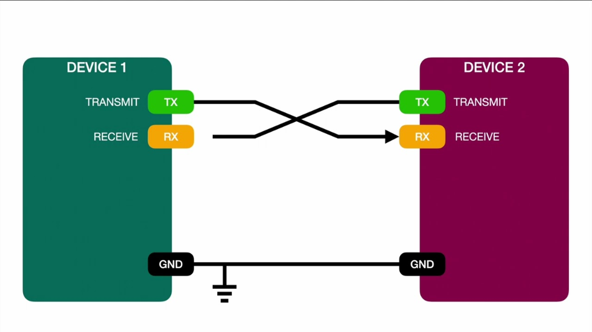
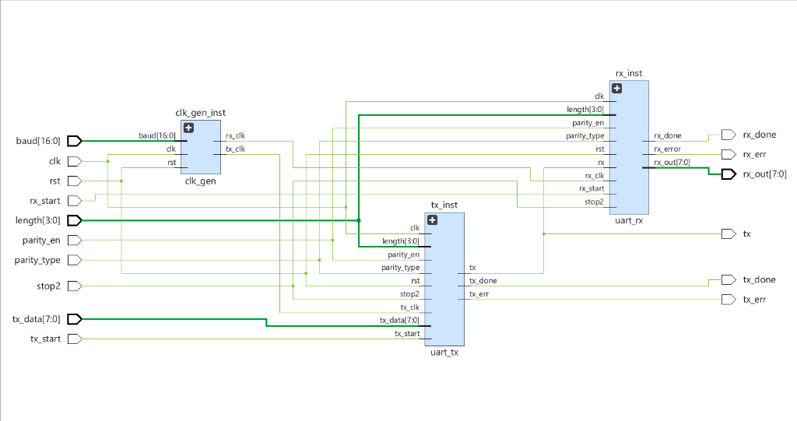

# UART: Universal Asynchronous Receiver-Transmitter

---

## 1. Hardware Connection

The diagram below illustrates the physical null-modem connection scheme between two UART devices. 

* **Cross-connected Data Lines**: The transmitter (`TX`) of Device 1 is connected directly to the receiver (`RX`) of Device 2, and vice-versa.
* **Shared Ground**: A common ground (`GND`) connection is established between both devices to ensure a shared reference potential.

---

## 2. RTL Architecture

The RTL schematic below illustrates the top-level integration (`uart_top`) of the UART controller sub-modules:

* **Clock Generator (`clk_gen_inst`)**: Takes the system `clk` and `baud` configuration to produce the synchronized baud clock `tx_clk` and the 16× oversampling clock `rx_clk`.
* **UART Transmitter (`tx_inst`)**: Loads parallel input data `tx_data` and serializes it onto the `tx` line according to frame length and parity configurations.
* **UART Receiver (`rx_inst`)**: Samples the incoming serial line `rx` (connected here in loopback to `tx` for demonstration/testing) and reconstructs the data bytes.

---

## 3. Transmitter (TX) FSM

The UART TX FSM serializes parallel data frame-by-frame. It operates on the core system clock and transitions state-to-state on ticks of `tx_clk`.

### 3.1 State Encoding
| State Name | Encoding (`bit [2:0]`) | Decimal |
| :--- | :--- | :--- |
| `idle` | `3'b000` | 0 |
| `start_bit` | `3'b001` | 1 |
| `send_data` | `3'b010` | 2 |
| `send_parity` | `3'b011` | 3 |
| `send_first_stop` | `3'b100` | 4 |
| `send_sec_stop` | `3'b101` | 5 |
| `done` | `3'b110` | 6 |
| `error_st` | `3'b111` | 7 |

### 3.2 State Transition Table
| Present State | Condition / Inputs | Next State | Action / Output Behavior |
| :--- | :--- | :--- | :--- |
| **IDLE** | `tx_start = 0` | **IDLE** | Drives `tx` line HIGH (`1` - idle bus level), resets counter. |
| **IDLE** | `tx_start = 1` && valid `length` (5-8) | **START_BIT** | Prepares to load `tx_data` into internal transmit register `tx_reg`. |
| **IDLE** | `tx_start = 1` && invalid `length` (<5 or >8) | **ERROR_ST** | Invalid configuration detected, aborts transmission. |
| **START_BIT** | *(unconditional)* | **SEND_DATA** | Drives `tx` line LOW (`0`) for one bit period to signal start of frame. |
| **SEND_DATA** | `count < (length - 1)` | **SEND_DATA** | Shifts out the next data bit (LSB-first) on `tx` line, increments bit counter. |
| **SEND_DATA** | `count = (length - 1)` && `parity_en = 1` | **SEND_PARITY** | Drives final data bit on `tx` and transitions to insert parity. |
| **SEND_DATA** | `count = (length - 1)` && `parity_en = 0` | **SEND_1ST_STOP** | Drives final data bit on `tx` and transitions directly to stop phase. |
| **SEND_PARITY** | *(unconditional)* | **SEND_1ST_STOP** | Drives the calculated parity bit (`odd` or `even`) on `tx` for one bit period. |
| **SEND_1ST_STOP** | `stop2 = 1` | **SEND_2ND_STOP** | Drives `tx` line HIGH (`1`) for the first mandatory stop bit period. |
| **SEND_1ST_STOP** | `stop2 = 0` | **DONE** | Drives `tx` line HIGH (`1`) and transitions to frame complete. |
| **SEND_2ND_STOP** | *(unconditional)* | **DONE** | Drives `tx` line HIGH (`1`) for the second optional stop bit period. |
| **DONE** | *(unconditional)* | **IDLE** | Asserts `tx_done` for one clock cycle to signal transmission completion. |
| **ERROR_ST** | *(unconditional)* | **IDLE** | Asserts `tx_err` and `tx_done` for one clock cycle to signal a configuration error. |

---

## 4. Receiver (RX) FSM

The UART RX FSM monitors the incoming serial data stream (`rx`) and reconstructs the parallel data frame. It utilizes 16× oversampling driven by `rx_clk` (16 ticks per baud period) to sample incoming bits at their mid-points for high signal-to-noise ratio and noise filtering.

### 4.1 State Encoding
| State Name | Encoding (`bit [2:0]`) | Decimal |
| :--- | :--- | :--- |
| `idle` | `3'b000` | 0 |
| `start_bit` | `3'b001` | 1 |
| `recv_data` | `3'b010` | 2 |
| `check_parity` | `3'b011` | 3 |
| `check_first_stop` | `3'b100` | 4 |
| `check_sec_stop` | `3'b101` | 5 |
| `done` | `3'b110` | 6 |
| `error_st` | `3'b111` | 7 |

### 4.2 State Transition Table
| Present State | Condition / Inputs | Next State | Action / Output Behavior |
| :--- | :--- | :--- | :--- |
| **IDLE** | `rx_start = 0` | **IDLE** | Monitors input line. Resets local variables and counters. |
| **IDLE** | `rx_start = 1` | **START_BIT** | Detects falling edge. Transitions to start bit validation state. |
| **START_BIT** | `count = 7` && `rx = 1` | **IDLE** | Mid-point check reveals line is HIGH. Discards as false start noise. |
| **START_BIT** | `count < 15` && !(`count = 7` && `rx = 1`) | **START_BIT** | Stays in state, increments oversampling counter. |
| **START_BIT** | `count = 15` | **RECV_DATA** | Successfully validated start bit. Resets counter. |
| **RECV_DATA** | `count < 15` \|\| `bit_count < (length - 1)` | **RECV_DATA** | Samples `rx` at `count = 7` (mid-bit) and shifts into `datard`. Increments `bit_count` at `count = 15`. |
| **RECV_DATA** | `count = 15` && `bit_count = (length - 1)` && `parity_en = 1` | **CHECK_PARITY** | All data bits received. Transitions to verify parity bit. |
| **RECV_DATA** | `count = 15` && `bit_count = (length - 1)` && `parity_en = 0` | **CHECK_1ST_STOP** | All data bits received. Transitions to verify first stop bit. |
| **CHECK_PARITY** | `count < 15` | **CHECK_PARITY** | Increments oversampling counter. |
| **CHECK_PARITY** | `count = 7` && `rx != parity` | **ERROR_ST** | Evaluates parity bit at mid-point. Aborts if mismatch detected. |
| **CHECK_PARITY** | `count = 15` | **CHECK_1ST_STOP** | Transitions to verify first stop bit if parity is valid. |
| **CHECK_1ST_STOP**| `count < 15` | **CHECK_1ST_STOP** | Increments oversampling counter. |
| **CHECK_1ST_STOP**| `count = 7` && `rx != 1` | **ERROR_ST** | Evaluates first stop bit at mid-point. Aborts if framing error. |
| **CHECK_1ST_STOP**| `count = 15` && `stop2 = 1` | **CHECK_2ND_STOP** | Transitions to verify second stop bit if valid. |
| **CHECK_1ST_STOP**| `count = 15` && `stop2 = 0` | **DONE** | Frame successfully received. Transitions to done. |
| **CHECK_2ND_STOP**| `count < 15` | **CHECK_2ND_STOP** | Increments oversampling counter. |
| **CHECK_2ND_STOP**| `count = 7` && `rx != 1` | **ERROR_ST** | Evaluates second stop bit at mid-point. Aborts if framing error. |
| **CHECK_2ND_STOP**| `count = 15` | **DONE** | Frame successfully received. Transitions to done. |
| **DONE** | *(unconditional)* | **IDLE** | Asserts `rx_done` for one clock cycle, presents reconstructed byte to `rx_out`. |
| **ERROR_ST** | *(unconditional)* | **IDLE** | Asserts `rx_error` and `rx_done` for one clock cycle to signal transaction failure. |

---

## 5. Register Configuration Parameters

* **`length` (3:0)**: Selects number of data bits in a frame:
  * `5` for 5-bit words
  * `6` for 6-bit words
  * `7` for 7-bit words
  * `8` for 8-bit words
* **`parity_en`**: Enables/disables parity generation and check:
  * `0`: Parity disabled
  * `1`: Parity enabled
* **`parity_type`**: Chooses parity type (when parity is enabled):
  * `0`: Even parity (check/generator uses XNOR reduction)
  * `1`: Odd parity (check/generator uses XOR reduction)
* **`stop2`**: Configures stop bits:
  * `0`: 1 stop bit
  * `1`: 2 stop bits

---

