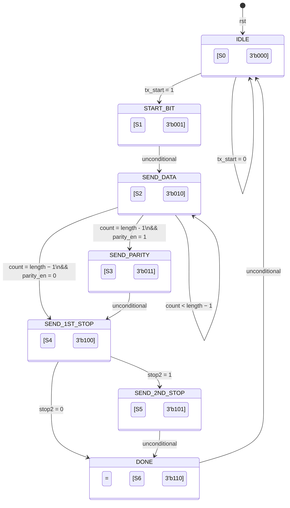
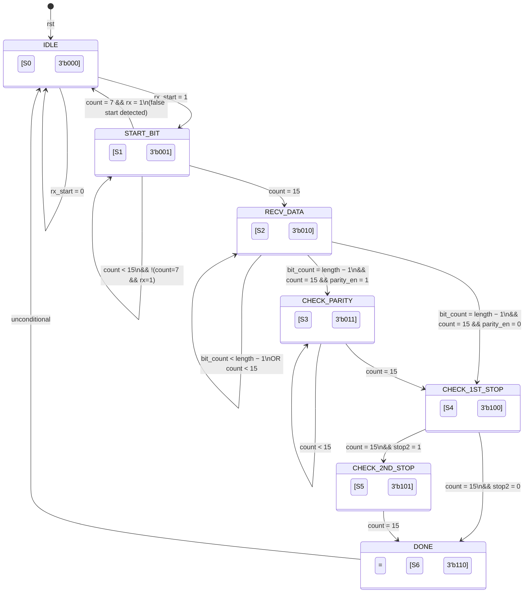

# UART FSM Diagrams — Industry-Standard Documentation

> [!NOTE]
> Extracted from [uart_tx.sv](file:///c:/Users/Saksham%20Gupta/Desktop/uart/uart_tx.sv) and [uart_rx.sv](file:///c:/Users/Saksham%20Gupta/Desktop/uart/uart_rx.sv). Both FSMs use a **3-bit state encoding** (`bit [2:0]`) and are clocked on the system `clk` with state transitions gated by `tx_clk` / `rx_clk` respectively.

---

## 1. UART TX — Transmitter FSM

### 1.1 State Transition Diagram (Generated)


### 1.2 State Transition Diagram (Mermaid)



### 1.3 State Encoding Table

| State Name | Encoding (`bit [2:0]`) | Decimal |
|---|---|---|
| `idle` | `3'b000` | 0 |
| `start_bit` | `3'b001` | 1 |
| `send_data` | `3'b010` | 2 |
| `send_parity` | `3'b011` | 3 |
| `send_first_stop` | `3'b100` | 4 |
| `send_sec_stop` | `3'b101` | 5 |
| `done` | `3'b110` | 6 |

### 1.4 State Transition Table

| Present State | Condition | Next State |
|---|---|---|
| **IDLE** | `tx_start = 0` | IDLE |
| **IDLE** | `tx_start = 1` | START_BIT |
| **START_BIT** | *(unconditional)* | SEND_DATA |
| **SEND_DATA** | `count < (length − 1)` | SEND_DATA |
| **SEND_DATA** | `count ≥ (length − 1)` && `parity_en = 1` | SEND_PARITY |
| **SEND_DATA** | `count ≥ (length − 1)` && `parity_en = 0` | SEND_1ST_STOP |
| **SEND_PARITY** | *(unconditional)* | SEND_1ST_STOP |
| **SEND_1ST_STOP** | `stop2 = 1` | SEND_2ND_STOP |
| **SEND_1ST_STOP** | `stop2 = 0` | DONE |
| **SEND_2ND_STOP** | *(unconditional)* | DONE |
| **DONE** | *(unconditional)* | IDLE |

### 1.5 Output Table (Mealy/Moore Hybrid)

| State | `tx` | `tx_done` | `tx_err` | `count` Action | Notes |
|---|---|---|---|---|---|
| **IDLE** | `1` (line high) | `0` | `0` | reset to 0 | Bus idle, waiting for `tx_start` |
| **START_BIT** | `0` (start bit) | — | — | reset to 0 | Loads `tx_data` → `tx_reg` |
| **SEND_DATA** | `tx_reg[count]` (LSB first) | — | — | increment | Serializes data bits |
| **SEND_PARITY** | `parity_bit` | — | — | reset to 0 | Odd: XOR, Even: XNOR |
| **SEND_1ST_STOP** | `1` (stop bit) | — | — | reset to 0 | First mandatory stop bit |
| **SEND_2ND_STOP** | `1` (stop bit) | — | — | reset to 0 | Optional second stop bit |
| **DONE** | — | `1` | — | reset to 0 | Asserts `tx_done` for 1 tx_clk cycle |

---

## 2. UART RX — Receiver FSM

### 2.1 State Transition Diagram (Generated)


### 2.2 State Transition Diagram (Mermaid)



### 2.3 State Encoding Table

| State Name | Encoding (`bit [2:0]`) | Decimal |
|---|---|---|
| `idle` | `3'b000` | 0 |
| `start_bit` | `3'b001` | 1 |
| `recv_data` | `3'b010` | 2 |
| `check_parity` | `3'b011` | 3 |
| `check_first_stop` | `3'b100` | 4 |
| `check_sec_stop` | `3'b101` | 5 |
| `done` | `3'b110` | 6 |

### 2.4 State Transition Table

| Present State | Condition | Next State |
|---|---|---|
| **IDLE** | `rx_start = 0` | IDLE |
| **IDLE** | `rx_start = 1` | START_BIT |
| **START_BIT** | `count = 7` && `rx = 1` | IDLE *(false start)* |
| **START_BIT** | `count < 15` && !(`count=7` && `rx=1`) | START_BIT |
| **START_BIT** | `count = 15` | RECV_DATA |
| **RECV_DATA** | `count < 15` OR `bit_count < (length − 1)` | RECV_DATA |
| **RECV_DATA** | `count = 15` && `bit_count = (length − 1)` && `parity_en = 1` | CHECK_PARITY |
| **RECV_DATA** | `count = 15` && `bit_count = (length − 1)` && `parity_en = 0` | CHECK_1ST_STOP |
| **CHECK_PARITY** | `count < 15` | CHECK_PARITY |
| **CHECK_PARITY** | `count = 15` | CHECK_1ST_STOP |
| **CHECK_1ST_STOP** | `count = 15` && `stop2 = 1` | CHECK_2ND_STOP |
| **CHECK_1ST_STOP** | `count = 15` && `stop2 = 0` | DONE |
| **CHECK_2ND_STOP** | `count = 15` | DONE |
| **DONE** | *(unconditional)* | IDLE |

### 2.5 Output Table (Mealy/Moore Hybrid)

| State | `rx_done` | `rx_error` | `count` Action | `bit_count` Action | Notes |
|---|---|---|---|---|---|
| **IDLE** | `0` | `0` | reset to 0 | reset to 0 | Waiting for `rx_start` |
| **START_BIT** | — | — | 0 → 15 cycle | — | 16× oversample; validates start bit at mid-point (count=7); if `rx=1` at count=7 → false start → back to IDLE |
| **RECV_DATA** | — | — | 0 → 15 per bit | increment at count=15 | Samples `rx` at mid-bit (count=7), shifts into `datard` register MSB-first. Outputs `rx_out` based on `length` at final bit |
| **CHECK_PARITY** | — | `rx ≠ parity` → 1 | 0 → 15 cycle | — | At count=7: compares received parity bit with computed parity (XOR for odd, XNOR for even) |
| **CHECK_1ST_STOP** | — | `rx ≠ 1` → 1 | 0 → 15 cycle | — | At count=7: validates stop bit is HIGH; framing error if LOW |
| **CHECK_2ND_STOP** | — | `rx ≠ 1` → 1 | 0 → 15 cycle | — | At count=7: validates optional 2nd stop bit |
| **DONE** | `1` | `0` | reset to 0 | reset to 0 | Asserts `rx_done` for 1 rx_clk cycle |

---

## 3. Key Design Notes

### 3.1 Clock Architecture
- **System clock**: `clk` (50 MHz assumed, 20 ns period)
- **TX clock** (`tx_clk`): 1× baud rate — one tick per bit period
- **RX clock** (`rx_clk`): 16× baud rate — 16 ticks per bit period for oversampling

### 3.2 RX 16× Oversampling Strategy
The RX FSM uses a `count` register (0–15) that cycles through 16 `rx_clk` ticks per bit:
- **count = 7** → mid-bit sampling point (optimal noise immunity)
- **count = 15** → end of bit period, triggers state transitions and `bit_count` increment

### 3.3 Parity Support
| `parity_type` | Method | Computation |
|---|---|---|
| `1` | Odd parity | `^data` (XOR reduction) |
| `0` | Even parity | `~^data` (XNOR reduction) |

### 3.4 Configurable Frame Format

```
┌───────────┬───────────────┬──────────────────────────┬──────────┬──────────────────┬──────────────────┐
│  IDLE (1) │ START BIT (0) │ DATA [LSB first, 5-8b]   │ PARITY?  │ STOP BIT 1 (1)   │ STOP BIT 2? (1)  │
└───────────┴───────────────┴──────────────────────────┴──────────┴──────────────────┴──────────────────┘
                              ◄─── length (5/6/7/8) ──►  parity_en   mandatory         stop2
```

### 3.5 FSM Type Classification
Both TX and RX FSMs are implemented as **Mealy machines** (combinational `always @(*)` block for next-state + output logic) with registered state transitions (sequential `always @(posedge clk)` block). The outputs depend on both the current state and input conditions (e.g., `tx = tx_reg[count]` in SEND_DATA, `rx_error` depends on `rx` value in CHECK states).
